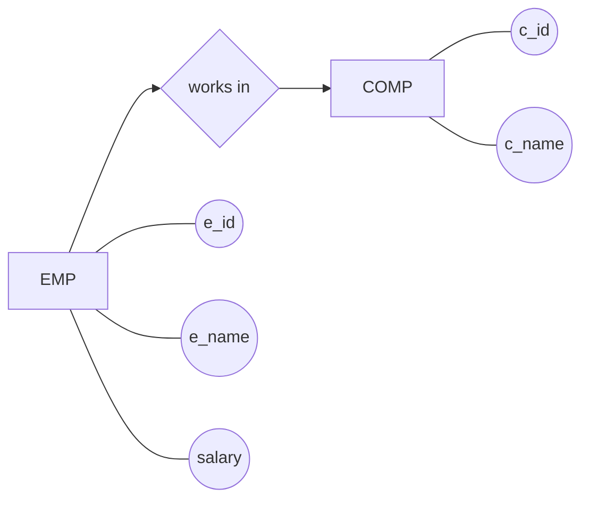
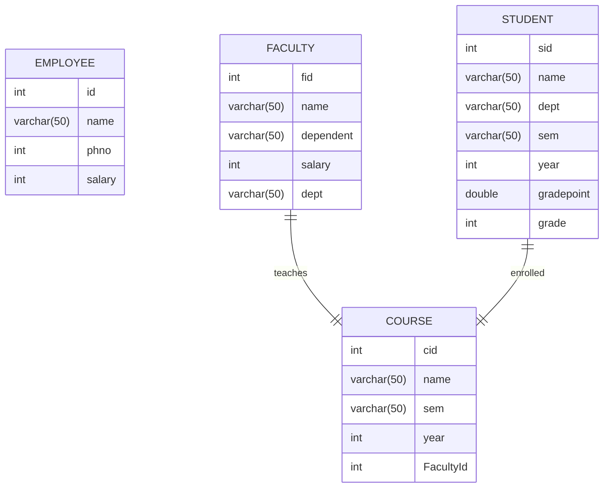
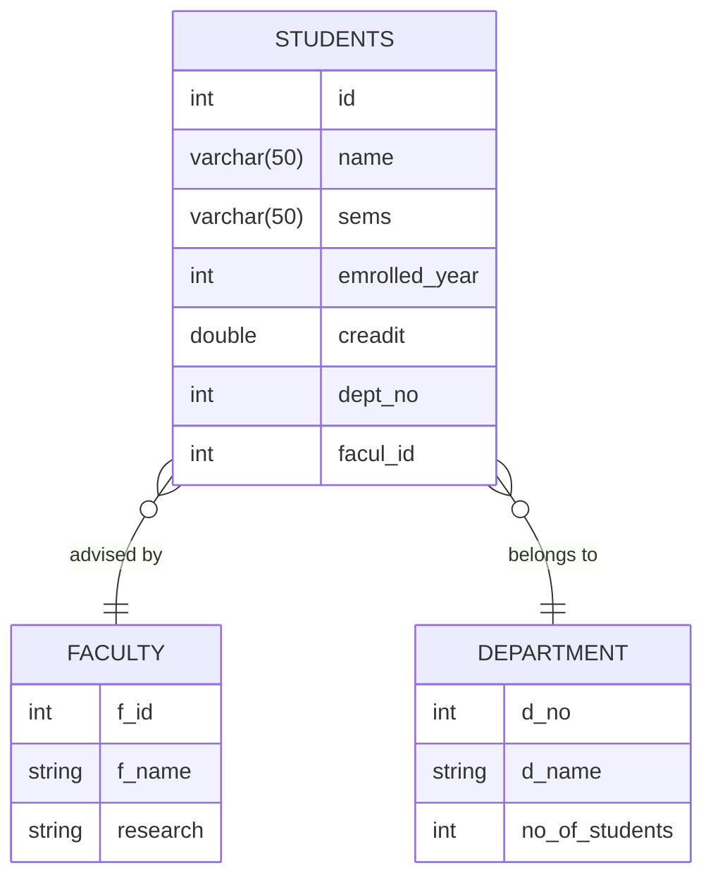
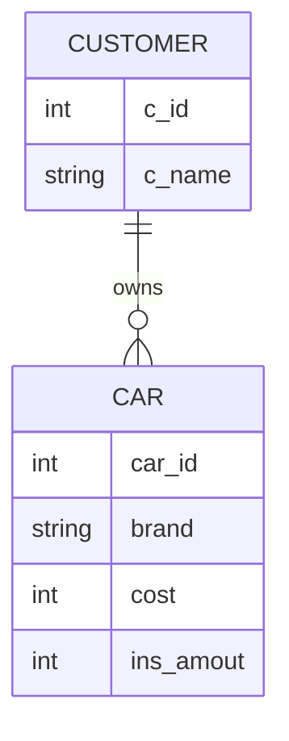
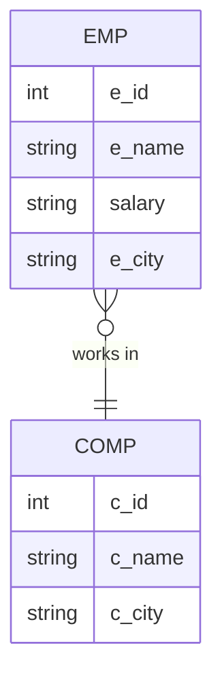

# ER Diagram (Diamond Style)

# Database Entity-Relationship Diagram

This diagram represents the structure of the FACULTY, COURSE, and STUDENT entities and their specified relationships.

# ER Diagram - University System

This ER diagram represents the relationship between **Students**, **Faculty**, and **Department**.

## 📊 ER Diagram

# ER Diagram - Car & Customer System

This ER diagram represents the relationship between **Car** and **Customer**.

## 📊 ER Diagram

# ER Diagram - EMP & COMP System

This ER diagram represents the relationship between **EMP (Employee)** and **COMP (Company)**.

## 📊 ER Diagram

